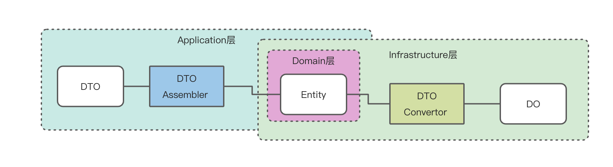

# Mall

> 心心念念的商城系统，开工了，一鼓作气，冲冲冲！

本项目结合 ChatGPT 设计实现，项目模板使用 [think-cola](https://github.com/AmosWang0626/think-cola)。

## 如何写一个Java商城项目

一个Java商城项目的实现涉及到多个方面，包括需求分析、系统设计、数据库设计、前端设计和后端开发等。下面是一个简单的步骤指南，可以帮助你开始一个Java商城项目：

### 需求分析

在项目开始之前，需要对商城系统的需求进行分析和定义。这包括用户需求、业务需求、功能需求等。你需要考虑到商城系统的基本功能，比如商品分类、商品管理、订单管理、用户管理等。除此之外，你还需要考虑到安全性、性能、用户体验等方面的需求。

### 系统设计

在需求分析的基础上，进行系统设计。系统设计包括构建系统的整体架构、功能模块划分、数据库设计等。你需要确定系统的技术选型，包括数据库、Web框架、前端框架等。你还需要设计系统的各种模块之间的接口和数据传输格式。

### 数据库设计

商城系统的数据库设计是至关重要的一步。你需要确定数据模型，包括商品模型、订单模型、用户模型等。你需要考虑到数据库的性能、可扩展性和数据安全等方面。

### 前端设计

商城系统的前端设计需要考虑到用户体验和界面美观度。你需要使用前端技术来实现商城系统的各种页面和功能模块，包括商品展示、购物车、订单结算等。

### 后端开发

商城系统的后端开发包括业务逻辑的实现、数据库的访问、接口的实现等。你需要使用Java编程语言，结合选定的Web框架，实现商城系统的各种功能模块。

### 测试和部署

完成商城系统的开发之后，需要进行测试和部署。测试包括单元测试、集成测试、系统测试等。部署需要将商城系统部署到服务器上，配置好运行环境、数据库等。

以上是一个简单的Java商城项目的开发流程，你可以根据自己的实际情况进行具体的实现。另外，商城系统的开发需要耗费大量的时间和精力，所以你需要有足够的耐心和毅力来完成这个项目。

## 项目规范

| 规范               | 用途                  | 解释                                    |
|------------------|---------------------|---------------------------------------|
| xxxCO            | Client Object       | 客户对象，用于传输数据，等同于DTO                    |
| xxxCmd           | Client Request      | Cmd代表Command，表示一个写请求                  |
| xxxQuery         | Client Request      | Query，表示一个读请求                         |
| xxxCmdExe        | Command Executor    | 命令模式，每一个写请求对应一个执行器                    |
| xxxQueryExe      | Query Executor      | 命令模式，每一个读请求对应一个执行器                    |
| xxxVO            | Value Object        | 值对象                                   |
| xxxEntity        | Entity              | 领域实体                                  |
| xxxDO            | Data Object         | 数据对象，用于持久化                            |
| xxxInterceptor   | Command Interceptor | 拦截器，用于处理切面逻辑                          |
| IxxService       | API Service         | 对外提供的API                              |
| xxxDomainService | Domain Service      | 需要多个领域对象协作时，使用DomainService           |
| xxxValidator     | Validator           | 校验器，用于校验的类                            |
| xxxAssembler     | Assembler           | 组装器，DTO <---> Entity，用于Application层   |
| xxxConvertor     | Convertor           | 转化器，Entity <---> DO，用于Infrastructure层 |

- Application：对外暴露的是DTO，不能暴露 Entity
- Domain：gateway对外暴露的是Entity，不能暴露 DO
- 所以这里有两套转换器 xxxAssembler 和 xxxConvertor
  

### 方法名约定

| CRUD操作   | 方法名约定                                       |
|----------|---------------------------------------------|
| 新增       | create                                      |
| 添加       | add                                         |
| 删除       | remove（App和Domain层），delete（Infrastructure层） |
| 修改       | update                                      |
| 查询（单个结果） | get                                         |
| 查询（多个结果） | list                                        |
| 分页查询     | page                                        |
| 统计       | count                                       |

